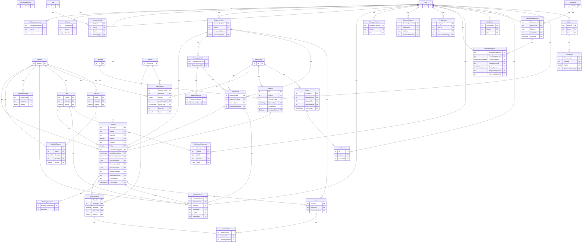

```mermaid
erDiagram
    AIConversationLog {
        int ConversationLogId PK
        int UserId FK
        User User FK
    }

    AIKnowledgeBase {
        int KnowledgeId PK
    }

    AuditLog {
        int AuditLogId PK
        int UserId FK
        string EntityId FK
    }

    Booking {
        int BookingId PK
        int UserId FK
        int BranchId FK
        Branch Branch FK
        int VehicleId FK
        Vehicle Vehicle FK
        int ActualVehicleTypeId FK
        VehicleType ActualVehicleType FK
        int ProcessingLaneId FK
        Lane ProcessingLane FK
        int ProcessingStaffId FK
        User ProcessingStaff FK
        int BusinessProfileId FK
        int AppliedVoucherId FK
        int FleetVehicleId FK
        FleetVehicle FleetVehicle FK
    }

    BookingDetail {
        int DetailId PK
        int BookingId FK
        Booking Booking FK
        int ServiceId FK
        Service Service FK
    }

    BookingDocument {
        int BookingDocumentId PK
        int BookingId FK
    }

    Branch {
        int BranchId PK
    }

    BusinessProfile {
        int BusinessProfileId PK
        int UserId FK
        int ReviewedByUserId FK
        User ReviewedByUser FK
    }

    CarModel {
        int Id PK
    }

    CustomerProfile {
        int ProfileId PK
        int UserId FK
        int TierId FK
        int ReferredById FK
    }

    DailySlotCapacity {
        int Id PK
        int SlotId FK
        TimeSlot TimeSlot FK
        int BranchId FK
        Branch Branch FK
    }

    EmployeeProfile {
        int EmployeeId PK
        int BranchId FK
        Branch Branch FK
    }

    FleetImportBatch {
        int FleetImportBatchId PK
        int BusinessProfileId FK
    }

    FleetImportError {
        int FleetImportErrorId PK
        int FleetImportBatchId FK
    }

    FleetVehicle {
        int FleetVehicleId PK
        int BusinessProfileId FK
        int VehicleTypeId FK
        int FleetImportBatchId FK
    }

    FleetWashLog {
        int FleetWashLogId PK
        int FleetVehicleId FK
        int BranchId FK
        int BookingId FK
        int LaneId FK
        int StaffUserId FK
    }

    Invoice {
        int InvoiceId PK
        int BookingId FK
        int BusinessProfileId FK
    }

    InvoiceItem {
        int InvoiceItemId PK
        int InvoiceId FK
        int BookingDetailId FK
    }

    Lane {
        int LaneId PK
        int BranchId FK
        Branch Branch FK
    }

    ManagerProfile {
        int ManagerProfileId PK
        int UserId FK
        User User FK
    }

    OvertimeRequest {
        int OvertimeRequestId PK
        int StaffUserId FK
        User StaffUser FK
        int ReviewedByUserId FK
    }

    PointLedger {
        int LedgerId PK
        int UserId FK
        User User FK
        int ReferenceBookingId FK
    }

    Service {
        int ServiceId PK
    }

    ServicePrice {
        int ServicePriceId PK
        int ServiceId FK
        Service Service FK
        int VehicleTypeId FK
        VehicleType VehicleType FK
        int BranchId FK
        Branch Branch FK
    }

    ShiftSwapRequest {
        int ShiftSwapRequestId PK
        int FromAssignmentId FK
        StaffShiftAssignment FromAssignment FK
        int ToAssignmentId FK
        StaffShiftAssignment ToAssignment FK
        int RequestedByUserId FK
        int ReviewedByUserId FK
    }

    StaffLaneAssignment {
        int AssignmentId PK
        int StaffId FK
        User Staff FK
        int LaneId FK
        Lane Lane FK
    }

    StaffProfile {
        int StaffProfileId PK
        int UserId FK
        User User FK
    }

    StaffShiftAssignment {
        int AssignmentId PK
        int StaffUserId FK
        User StaffUser FK
        int WorkShiftId FK
        WorkShift WorkShift FK
    }

    Tier {
        int TierId PK
    }

    TimeSlot {
        int SlotId PK
        int BranchId FK
        Branch Branch FK
    }

    Transaction {
        int TransactionId PK
        int WalletId FK
        Wallet Wallet FK
        int ReferenceBookingId FK
    }

    User {
        int UserId PK
    }

    UserVoucher {
        int Id PK
        int UserId FK
        int VoucherId FK
    }

    Vehicle {
        int Id PK
        int UserId FK
        int VehicleTypeId FK
        VehicleType VehicleType FK
        int CarModelId FK
        CarModel CarModelEntity FK
    }

    VehicleType {
        int Id PK
    }

    Voucher {
        int VoucherId PK
        int RequiredTierId FK
        Tier RequiredTier FK
        int VehicleTypeId FK
        VehicleType VehicleType FK
    }

    Wallet {
        int WalletId PK
        int UserId FK
        User User FK
    }

    WorkShift {
        int WorkShiftId PK
    }

    User ||--o{ AIConversationLog : "has"
    User ||--o{ AuditLog : "has"
    User ||--o{ Booking : "has"
    Branch ||--o{ Booking : "has"
    Vehicle ||--o{ Booking : "has"
    Lane ||--o{ Booking : "has"
    BusinessProfile ||--o{ Booking : "has"
    FleetVehicle ||--o{ Booking : "has"
    Booking ||--o{ BookingDetail : "has"
    Service ||--o{ BookingDetail : "has"
    Booking ||--o{ BookingDocument : "has"
    User ||--o{ BusinessProfile : "has"
    User ||--o{ CustomerProfile : "has"
    Tier ||--o{ CustomerProfile : "has"
    TimeSlot ||--o{ DailySlotCapacity : "has"
    Branch ||--o{ DailySlotCapacity : "has"
    Branch ||--o{ EmployeeProfile : "has"
    BusinessProfile ||--o{ FleetImportBatch : "has"
    FleetImportBatch ||--o{ FleetImportError : "has"
    BusinessProfile ||--o{ FleetVehicle : "has"
    VehicleType ||--o{ FleetVehicle : "has"
    FleetImportBatch ||--o{ FleetVehicle : "has"
    FleetVehicle ||--o{ FleetWashLog : "has"
    Branch ||--o{ FleetWashLog : "has"
    Booking ||--o{ FleetWashLog : "has"
    Lane ||--o{ FleetWashLog : "has"
    User ||--o{ FleetWashLog : "has"
    Booking ||--o{ Invoice : "has"
    BusinessProfile ||--o{ Invoice : "has"
    Invoice ||--o{ InvoiceItem : "has"
    BookingDetail ||--o{ InvoiceItem : "has"
    Branch ||--o{ Lane : "has"
    User ||--o{ ManagerProfile : "has"
    User ||--o{ OvertimeRequest : "has"
    User ||--o{ PointLedger : "has"
    Service ||--o{ ServicePrice : "has"
    VehicleType ||--o{ ServicePrice : "has"
    Branch ||--o{ ServicePrice : "has"
    StaffShiftAssignment ||--o{ ShiftSwapRequest : "has"
    User ||--o{ ShiftSwapRequest : "has"
    User ||--o{ StaffLaneAssignment : "has"
    Lane ||--o{ StaffLaneAssignment : "has"
    User ||--o{ StaffProfile : "has"
    User ||--o{ StaffShiftAssignment : "has"
    WorkShift ||--o{ StaffShiftAssignment : "has"
    Branch ||--o{ TimeSlot : "has"
    Wallet ||--o{ Transaction : "has"
    User ||--o{ UserVoucher : "has"
    Voucher ||--o{ UserVoucher : "has"
    User ||--o{ Vehicle : "has"
    VehicleType ||--o{ Vehicle : "has"
    CarModel ||--o{ Vehicle : "has"
    VehicleType ||--o{ Voucher : "has"
    User ||--o{ Wallet : "has"
```
