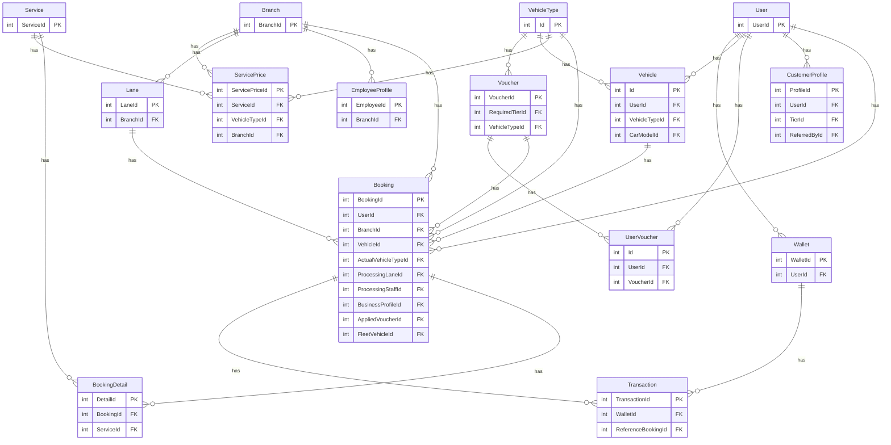

```mermaid
erDiagram
    Booking {
        int BookingId PK
        int UserId FK
        int BranchId FK
        int VehicleId FK
        int ActualVehicleTypeId FK
        int ProcessingLaneId FK
        int ProcessingStaffId FK
        int BusinessProfileId FK
        int AppliedVoucherId FK
        int FleetVehicleId FK
    }

    BookingDetail {
        int DetailId PK
        int BookingId FK
        int ServiceId FK
    }

    Branch {
        int BranchId PK
    }

    CustomerProfile {
        int ProfileId PK
        int UserId FK
        int TierId FK
        int ReferredById FK
    }

    EmployeeProfile {
        int EmployeeId PK
        int BranchId FK
    }

    Lane {
        int LaneId PK
        int BranchId FK
    }

    Service {
        int ServiceId PK
    }

    ServicePrice {
        int ServicePriceId PK
        int ServiceId FK
        int VehicleTypeId FK
        int BranchId FK
    }

    Transaction {
        int TransactionId PK
        int WalletId FK
        int ReferenceBookingId FK
    }

    User {
        int UserId PK
    }

    UserVoucher {
        int Id PK
        int UserId FK
        int VoucherId FK
    }

    Vehicle {
        int Id PK
        int UserId FK
        int VehicleTypeId FK
        int CarModelId FK
    }

    VehicleType {
        int Id PK
    }

    Voucher {
        int VoucherId PK
        int RequiredTierId FK
        int VehicleTypeId FK
    }

    Wallet {
        int WalletId PK
        int UserId FK
    }

    User ||--o{ Booking : "has"
    Branch ||--o{ Booking : "has"
    Vehicle ||--o{ Booking : "has"
    VehicleType ||--o{ Booking : "has"
    Lane ||--o{ Booking : "has"
    Voucher ||--o{ Booking : "has"
    Booking ||--o{ BookingDetail : "has"
    Service ||--o{ BookingDetail : "has"
    User ||--o{ CustomerProfile : "has"

    Branch ||--o{ EmployeeProfile : "has"
    Branch ||--o{ Lane : "has"
    Service ||--o{ ServicePrice : "has"
    VehicleType ||--o{ ServicePrice : "has"
    Branch ||--o{ ServicePrice : "has"
    Wallet ||--o{ Transaction : "has"
    Booking ||--o{ Transaction : "has"
    User ||--o{ UserVoucher : "has"
    Voucher ||--o{ UserVoucher : "has"
    User ||--o{ Vehicle : "has"
    VehicleType ||--o{ Vehicle : "has"
    VehicleType ||--o{ Voucher : "has"
    User ||--o{ Wallet : "has"
```
