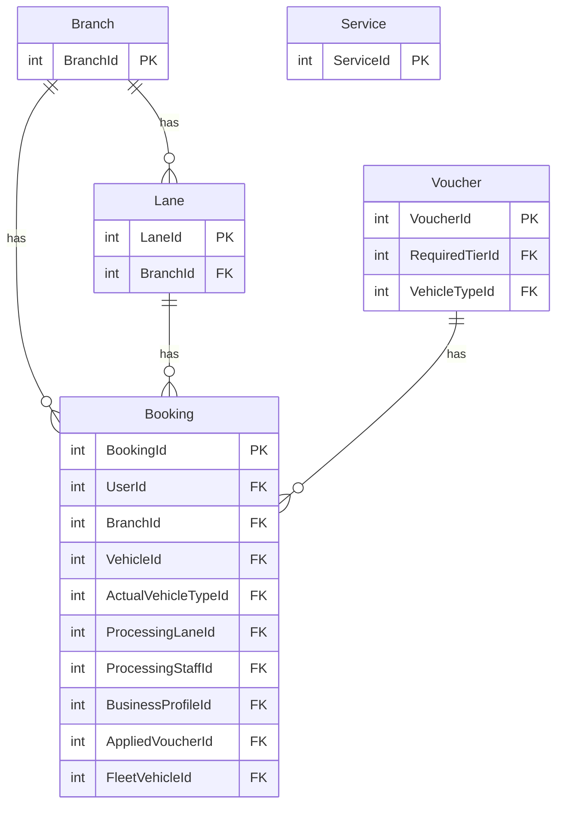

```mermaid
erDiagram
    Booking {
        int BookingId PK
        int UserId FK
        int BranchId FK
        int VehicleId FK
        int ActualVehicleTypeId FK
        int ProcessingLaneId FK
        int ProcessingStaffId FK
        int BusinessProfileId FK
        int AppliedVoucherId FK
        int FleetVehicleId FK
    }

    Branch {
        int BranchId PK
    }

    Lane {
        int LaneId PK
        int BranchId FK
    }

    Service {
        int ServiceId PK
    }

    Voucher {
        int VoucherId PK
        int RequiredTierId FK
        int VehicleTypeId FK
    }

    Branch ||--o{ Booking : "has"
    Lane ||--o{ Booking : "has"
    Voucher ||--o{ Booking : "has"
    Branch ||--o{ Lane : "has"
```
